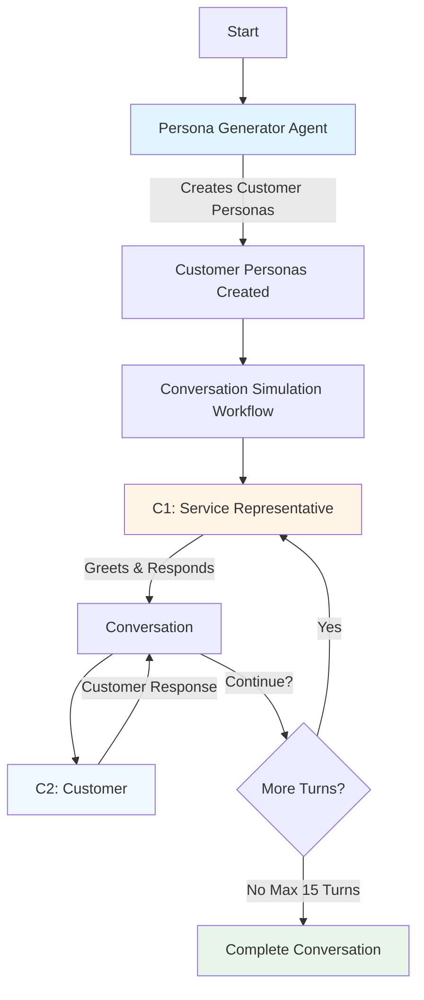

# Conversation Simulation & Evaluation Strategy

## Table of Contents

- [Overview](#overview)
- [How It Works](#how-it-works)
  - [Step 1: Persona Generation](#step-1-persona-generation)
  - [Step 2: Conversation Simulation](#step-2-conversation-simulation)
- [Evaluation Strategy](#evaluation-strategy)
  - [1. Default Metrics](#1-default-metrics)
  - [2. Groundedness Evaluator](#2-groundedness-evaluator)
  - [3. Custom Criteria (Our Specialized Evaluation)](#3-custom-criteria-our-specialized-evaluation)
    - [Criterion 1: Persona Adherence](#criterion-1-persona-adherence)
    - [Criterion 2: Goal Pursuit](#criterion-2-goal-pursuit)
- [Scoring System](#scoring-system)
- [Why This Matters](#why-this-matters)
  - [Benefits of Conversation Simulation](#benefits-of-conversation-simulation)
  - [Benefits of Multi-Faceted Evaluation](#benefits-of-multi-faceted-evaluation)
- [Summary](#summary)

---

## Overview

Our conversation simulation system generates realistic customer service conversations at scale using AI agents. This enables us to test and improve our customer service systems without relying solely on real customer data.

---

## How It Works

### Step 1: Persona Generation
The **Persona Generator Agent** creates detailed customer personas including:
- **Customer Intent**: What the customer wants to achieve (e.g., billing inquiry, technical support)
- **Customer Sentiment**: How the customer feels (e.g., frustrated, neutral, satisfied)
- **Conversation Subject**: The specific topic or issue
- **Customer Metadata**: Additional context about the customer

### Step 2: Conversation Simulation
Once we have customer personas, the simulation begins:

1. **C1 (Service Representative)** greets the customer and starts the conversation
2. **C2 (Customer)** responds based on their assigned persona
3. They go back and forth for up to **15 turns**
4. The conversation continues until:
   - The issue is resolved
   - The representative transfers the call
   - Maximum 15 turns is reached

---

## Evaluation Strategy

We evaluate the quality of these simulated conversations using three different approaches:

### 1. Default Metrics
**What it measures**: Domain-agnostic quality metrics to evaluate conversation quality

The Default Evaluator applies six standard metrics, each scored on a **0-10 scale**:

- **Accuracy**: How well the response matches the ground truth in correctness and coverage; penalizes contradictions and major omissions
- **Groundedness**: Ensures the response is strictly supported by the provided reference, avoiding unsupported or hallucinated details
- **Completeness**: Whether the response fully covers all essential aspects without missing key details
- **Relevance**: Checks that the response stays on-topic and aligned with the user's intent and context
- **Noise Sensitivity**: Evaluates robustness to minor, irrelevant variations in input; consistent answers despite small changes
- **Conversationality**: Rates clarity, readability, natural flow, and tone; ensures structure is appropriate for the audience

**Best for**: Quick quality checks and baseline comparisons across different scenarios

---

### 2. Groundedness Evaluator
**What it measures**: How well outputs are anchored to authoritative source material

A specialized evaluator that focuses on **source fidelity**:
- **Source Alignment**: All factual statements match the authoritative source exactly in meaning
- **Traceability**: Each fact or metric can be linked to a specific location in the source material
- **No Unsupported Claims**: No speculative or inferred content unless explicitly labeled as such
- Ensures every fact, figure, or statement can be traced back to a trusted reference

**Best for**: Compliance-sensitive workflows where traceability is mandatory and ensuring reliability and trustworthiness of conversations

---

### 3. Custom Criteria (Our Specialized Evaluation)

For conversation simulation, we use two custom criteria that match what matters for realistic customer service interactions:

#### Criterion 1: Persona Adherence
**Category**: Conversationality
**What we check**: Does the customer stay true to their assigned character?

The customer should maintain consistency with their assigned persona throughout the conversation. We verify that:
- Customer messages align with their assigned **intent**, **sentiment**, and **subject**
- The customer's behavior matches their persona
- It's acceptable for sentiment to evolve naturally (e.g., frustrated customer becomes satisfied after receiving help)
- Changes in sentiment should feel realistic and believable

**Example**: If a customer starts as "frustrated about billing error," they shouldn't suddenly become cheerful without the representative addressing their concern first.

---

#### Criterion 2: Goal Pursuit
**Category**: Usefulness
**What we check**: Does the customer actively work towards achieving their goal?

The customer should consistently pursue their stated objective. We verify that:
- Customer messages reflect their intent to accomplish their goal
- The customer doesn't deviate from their original objective
- No unrelated topics are introduced by the customer
- The conversation stays focused on resolving the customer's issue

**Example**: If a customer's goal is to "dispute a charge on their bill," they shouldn't suddenly ask about upgrading their service plan unless it's relevant to resolving the billing issue.

---

## Scoring System

All evaluations use a consistent scoring approach:
- **Score Range**: 0 to 10
- **Passing Threshold**: 7 or higher
- **10 (HighScore)**: Fully meets or exceeds the metric's requirements
- **7-9**: Good - meets criteria with minor issues
- **4-6**: Fair - significant issues present
- **1-3**: Poor - fails to meet criteria
- **0 (LowScore)**: Does not meet the metric's basic requirements

---

## Why This Matters

### Benefits of Conversation Simulation
1. **Scale**: Generate thousands of conversations quickly
2. **Diversity**: Create scenarios covering various intents, sentiments, and subjects
3. **Control**: Test specific edge cases and scenarios on demand
4. **Privacy**: No real customer data needed for testing
5. **Cost-Effective**: Cheaper than manually creating test scenarios

### Benefits of Multi-Faceted Evaluation
1. **Default Metrics**: Quick sanity checks for basic quality
2. **Groundedness Evaluator**: Ensures reliability and prevents misinformation
3. **Custom Criteria**: Validates business-specific requirements
4. **Comprehensive**: Catches different types of issues across multiple dimensions

---

## Summary

Our conversation simulation system creates realistic customer service conversations by:
1. Generating detailed customer personas
2. Simulating natural back-and-forth conversations between customers and service representatives
3. Evaluating conversations using multiple quality lenses (default, groundedness, custom)

This approach enables us to test and improve our customer service systems at scale while ensuring high quality and realistic interactions.
