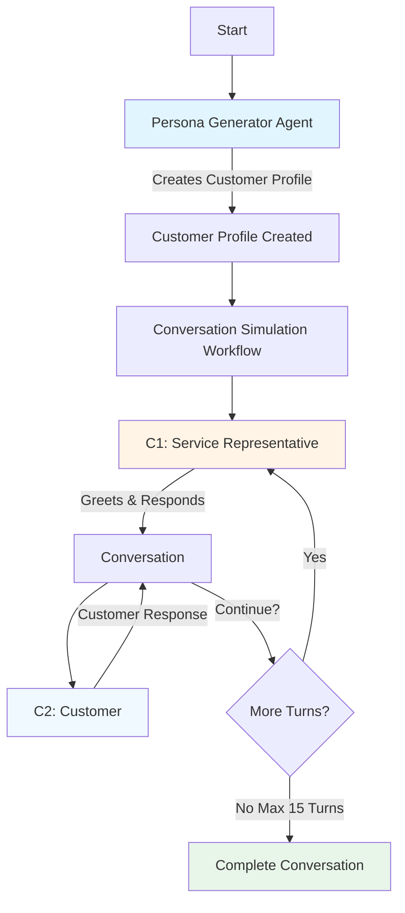

# Synthetic Data Generation & Evaluation Strategy
## Conversation Simulation

---

## Overview

Our conversation simulation system generates realistic customer service conversations at scale using AI agents. This enables us to test and improve our customer service systems without relying solely on real customer data.

---

## How It Works

### Step 1: Persona Generation
The **Persona Generator Agent** creates detailed customer profiles including:
- **Customer Intent**: What the customer wants to achieve (e.g., billing inquiry, technical support)
- **Customer Sentiment**: How the customer feels (e.g., frustrated, neutral, satisfied)
- **Conversation Subject**: The specific topic or issue
- **Customer Metadata**: Additional context about the customer

### Step 2: Conversation Simulation
Once we have a customer profile, the simulation begins:

1. **C1 (Service Representative)** greets the customer and starts the conversation
2. **C2 (Customer)** responds based on their assigned persona
3. They go back and forth for up to **15 turns**
4. The conversation continues until:
   - The issue is resolved
   - The representative transfers the call
   - Maximum 15 turns is reached

---

## Evaluation Strategy

We evaluate the quality of these simulated conversations using three different approaches:

### 1. Default Metrics
**What it measures**: General conversation quality using industry-standard metrics
- **Coherence**: Does the conversation flow naturally?
- **Fluency**: Are the messages well-written and clear?
- **Relevance**: Do responses stay on topic?

**Best for**: Quick quality checks and baseline comparisons

---

### 2. Groundedness
**What it measures**: How well the responses stick to facts and avoid making things up
- Ensures the customer and representative stay grounded in reality
- Prevents hallucinations or unrealistic claims
- Validates that responses are factual and consistent

**Best for**: Ensuring reliability and trustworthiness of conversations

---

### 3. Custom Criteria (Our Specialized Evaluation)

For conversation simulation, we use two custom criteria that match what matters for realistic customer service interactions:

#### Criterion 1: Persona Adherence
**Category**: Conversationality
**What we check**: Does the customer stay true to their assigned character?

The customer should maintain consistency with their assigned profile throughout the conversation. We verify that:
- Customer messages align with their assigned **intent**, **sentiment**, and **subject**
- The customer's behavior matches their persona
- It's acceptable for sentiment to evolve naturally (e.g., frustrated customer becomes satisfied after receiving help)
- Changes in sentiment should feel realistic and believable

**Example**: If a customer starts as "frustrated about billing error," they shouldn't suddenly become cheerful without the representative addressing their concern first.

---

#### Criterion 2: Goal Pursuit
**Category**: Usefulness
**What we check**: Does the customer actively work towards achieving their goal?

The customer should consistently pursue their stated objective. We verify that:
- Customer messages reflect their intent to accomplish their goal
- The customer doesn't deviate from their original objective
- No unrelated topics are introduced by the customer
- The conversation stays focused on resolving the customer's issue

**Example**: If a customer's goal is to "dispute a charge on their bill," they shouldn't suddenly ask about upgrading their service plan unless it's relevant to resolving the billing issue.

---

## Scoring System

All evaluations use a consistent scoring approach:
- **Score Range**: 1 to 10
- **Passing Threshold**: 7 or higher
- **10**: Perfect - meets all criteria excellently
- **7-9**: Good - meets criteria with minor issues
- **4-6**: Fair - significant issues present
- **1-3**: Poor - fails to meet criteria

---

## Why This Matters

### Benefits of Synthetic Data Generation
1. **Scale**: Generate thousands of conversations quickly
2. **Diversity**: Create scenarios covering various intents, sentiments, and subjects
3. **Control**: Test specific edge cases and scenarios on demand
4. **Privacy**: No real customer data needed for testing
5. **Cost-Effective**: Cheaper than manually creating test scenarios

### Benefits of Multi-Faceted Evaluation
1. **Default Metrics**: Quick sanity checks for basic quality
2. **Groundedness**: Ensures reliability and prevents misinformation
3. **Custom Criteria**: Validates business-specific requirements
4. **Comprehensive**: Catches different types of issues across multiple dimensions

---

## Summary

Our synthetic data generation system creates realistic customer service conversations by:
1. Generating detailed customer personas
2. Simulating natural back-and-forth conversations between customers and service representatives
3. Evaluating conversations using multiple quality lenses (default, groundedness, custom)

This approach enables us to test and improve our customer service systems at scale while ensuring high quality and realistic interactions.
